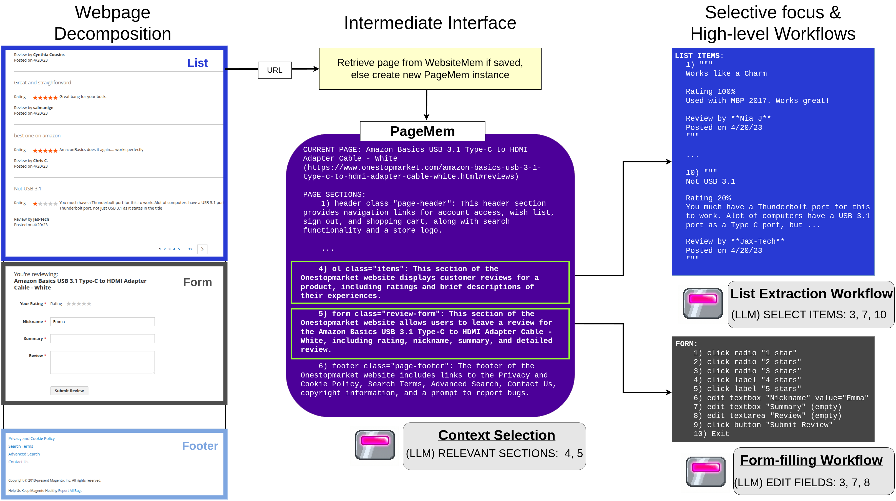

# WebChallenger: A Reliable and Efficient Generalist Web Agent

📄 [Paper](PAPER_URL) | 🌐 [Website](WEBSITE_URL) | ✍️ [Blog](BLOG_URL)

WebChallenger is a web agent framework built around **PageMem**, a structured page representation deterministically constructed from the DOM that exposes each page as a hierarchy of semantic sections with short summaries. On this shared substrate it builds three mechanisms that mirror human advantages in web navigation:

- **Divide-and-conquer observation**: the agent skims section summaries and extracts details only from task-relevant regions, keeping prompts small.
- **Offline exploration & memory**: a lightweight crawl traverses each website once to build a reusable map of pages and element behaviors, shared across all tasks on a site.
- **Compound action workflows**: common multi-step interactions (form-filling, dropdowns, search, etc.) collapse into single agent actions that handle partial state changes automatically.

Because all three operate over PageMem, the framework generalizes across websites without site-specific adapters. Using off-the-shelf open-weight models with no fine-tuning, WebChallenger sets new open-model state-of-the-art on four web navigation benchmarks (56.3% on WebArena, 48.7% on VisualWebArena, 51.0% on Online-Mind2Web, and 70.9% on WorkArena), approaching frontier proprietary systems at a fraction of the cost.



*Overview of WebChallenger. (left) Each webpage is decomposed along the DOM into sections corresponding to semantic regions. (middle) Sections are indexed by short summaries to form a PageMem, cached in per-website memory; the agent skims summaries and expands only task-relevant sections. (right) Specialized multi-step workflows are executed based on section type.*

## Environment Setup

### Install poetry

Follow [https://python-poetry.org/docs/](https://python-poetry.org/docs/)


### Install dependency

``` bash
poetry install
```

This will install all necessary dependencies for:

1. Agent code (playwright and other misc. packages)
2. Benchmark code


### WebArena / VisualWebArena setup
1. Setup simulation environment servers by following the official repo [instructions](https://github.com/web-arena-x/visualwebarena/blob/main/environment_docker/README.md).
2. Configure environment variables
```
export CLASSIFIEDS="<server_domain>:9980"
export CLASSIFIEDS_RESET_TOKEN="4b61655535e7ed388f0d40a93600254c"  # Default reset token 
export SHOPPING="<server_domain>:7770"
export REDDIT="<server_domain>:9999"
export WIKIPEDIA="<server_domain>:8888"
export SHOPPING_ADMIN="<server_domain>:7780/admin"
export GITLAB="<server_domain>:8023"
export MAP="<server_domain>:3000"

export OPENAI_API_KEY="<your_key>"
```
3. Generate task config files with your server urls:
```
python webchallenger/benchmarks/visualwebarena/scripts/generate_test_data.py
```


### WorkArena setup
Gain access to WorkArena environment instances by following these instructions from the official [repo](https://github.com/ServiceNow/WorkArena).
1. Navigate to https://huggingface.co/datasets/ServiceNow/WorkArena-Instances.
2. Fill the form, accept the terms to gain access to the gated repository and wait for approval.
3. Ensure that the machine where you will run WorkArena is authenticated with Hugging Face (e.g., via huggingface-cli login or the HUGGING_FACE_HUB_TOKEN environment variable).

Then install WorkArena
```
poetry add browsergym-workarena
```
**Note**: Installing workarena currently results in a Playwright version mismatch error as `browsergym-workarena` requires `playwright==1.44.0` but our agent code requires `playwright==1.52.0`. Bypass by commenting out the Playwright version check at lines 7-11 of `"<install_location>/browsergym/workarena/__init__.py"`.


### Dev environment

```bash
poetry shell
```

This will spin up a new shell with the venv activated.


## Model setup

(**Note**: WebChallenger uses significantly more LLM inference calls per agent step compared to more common agent frameworks. It is recommended to use models running locally on GPU or models with cheap API token prices.)

#### Option A - Local Inference
1. Set up local LLM inference engine with OpenAI compatible API (e.g., [vllm](https://github.com/vllm-project/vllm), [tabbyAPI](https://github.com/theroyallab/tabbyAPI), [llama.cpp](https://github.com/ggml-org/llama.cpp), etc.).
2. Start 2 servers, one for LLM at port 5000 ([GLM-4-32B-0414](https://huggingface.co/zai-org/GLM-4-32B-0414)), one for VLM at port 5001 ([Qwen2.5-VL](https://huggingface.co/Qwen/Qwen2.5-VL-7B-Instruct))

#### Option B - API Inference
1. Set up API keys. 
```
export LLM_API_KEY="<your_key>"
export VLM_API_KEY="<your_key>"
```
2. Pass provider URL and model name arguments. For example, to run with GLM-4-32B and Qwen-2.5-7B through openrouter use:
```
webchal \
--benchmark "webarena" \
--llm_api_url="https://openrouter.ai/api" \
--llm_api_model="z-ai/glm-4-32b" \
--vlm_api_url="https://openrouter.ai/api" \
--vlm_api_model="qwen/qwen-2.5-vl-7b-instruct"
```


## Run experiments
To reproduce experiments, first run exploration to produce the website memory files before running benchmark evaluations. The memory files will be saved to `webchallenger/memory/saved_files` and the benchmark trajectory logs will be saved to `webchallenger/results`.

### WebArena
Create memory files
```bash
webchal --explore_websites "webarena"
```
Run benchmark
```
webchal --benchmark "webarena"
```

### VisualWebArena
Create memory files
```bash
webchal --explore_websites "visualwebarena"
```
Run benchmark
```
webchal --benchmark "visualwebarena"
```

### WorkArena
Create memory files
```bash
webchal --explore_websites "workarena_l1"
```
Run benchmark
```
webchal --benchmark "workarena_l1"
```

### Online-Mind2Web
Create memory files
```bash
webchal --explore_websites "online_mind2web"
```
Run benchmark
```
webchal --benchmark "online_mind2web"
```


## Custom
(optional) Explore and create memory files for websites
```
webchal --explore_websites "{url_1}, {url_2}"
```

Example showing how to run the agent starting from a custom url and task
```
webchal --start_url "https://en.wikipedia.org/wiki/Main_Page" --intent "Navigate to the contents page"
```